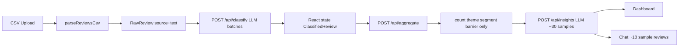
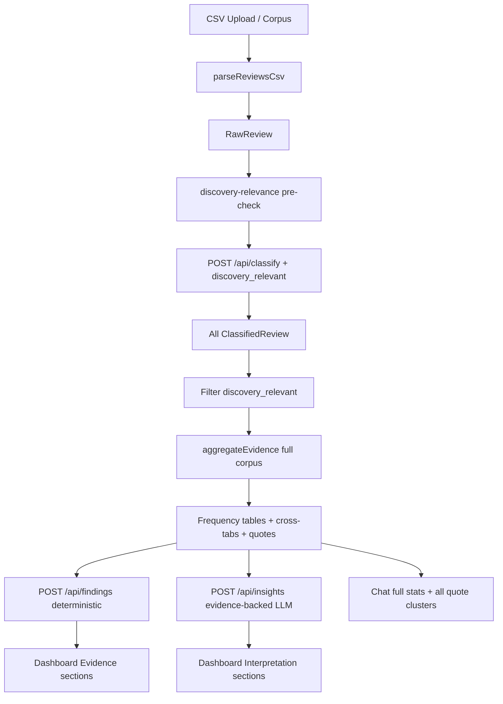

# Architecture Refactor — Evidence-Backed Behavioral Intelligence

## 1. Current architecture



**Gaps (resolved):** ~~behavior/emotion/root_cause/unmet_need ignored~~; ~~no cross-tabs~~; ~~no relevance filter~~; ~~insights/chat use tiny samples~~.

**Status:** Implemented — see `lib/aggregation.ts`, `lib/evidence.ts`, `lib/findings.ts`, `app/api/findings/route.ts`.

---

## 2. Proposed architecture



---

## 3. Files to change

| File | Change |
|------|--------|
| `lib/types.ts` | Extended models: evidence, cross-tabs, findings, interpretation |
| `lib/discovery-relevance.ts` | **NEW** — pre-classification relevance filter |
| `lib/aggregation.ts` | Full dimension aggregation + cross-tabs + quotes |
| `lib/evidence.ts` | **NEW** — quote extraction, findings builder, cross-tab helpers |
| `lib/classify-prompt.ts` | Add `discovery_relevant` to schema |
| `lib/classify.ts` | Normalize `discovery_relevant` |
| `lib/classify-mock.ts` | Relevance + field updates |
| `lib/insights-prompt.ts` | Evidence payload instead of 30 samples |
| `lib/insights.ts` | Split interpretation; consume full evidence |
| `lib/insights-mock.ts` | Evidence-backed mock |
| `lib/chat-context.ts` | Full evidence + quote clusters |
| `lib/chat-prompt.ts` | Cite quotes requirement |
| `lib/chat-mock.ts` | Use new context fields |
| `lib/export-report.ts` | Include findings + evidence |
| `app/api/aggregate/route.ts` | Return full evidence |
| `app/api/insights/route.ts` | Evidence in, interpretation out |
| `app/api/findings/route.ts` | **NEW** — Research Findings Summary |
| `components/dashboard/*` | New evidence sections + interpretation labels |
| `components/upload/UploadSection.tsx` | Pipeline state for findings |

---

## 4. Data model changes

### ClassifiedReview
```ts
discovery_relevant: boolean;
// existing: theme, behavior, emotion, segment, barrier, root_cause, unmet_need, confidence
```

### AggregationResult (Evidence)
```ts
totalReviews, discoveryRelevantCount, excludedCount,
themeFrequency, behaviorFrequency, emotionFrequency,
segmentBreakdown, barrierAnalysis, rootCauseFrequency, unmetNeedFrequency,
sourceBreakdown,
segmentThemeCrossTab, segmentBarrierCrossTab, segmentUnmetNeedCrossTab,
themeEvidence, rootCauseEvidence, unmetNeedEvidence, behaviorEvidence,
repetitionEvidence
```

### InterpretationResult
```ts
summary, rootCauses[], discoveryProblems[], opportunities[]
```

### ResearchFindings (answers 6 PM questions)
```ts
why_discovery_fails, top_frustrations[], listening_behaviors[],
repetition_causes[], segment_challenges{}, unmet_needs[]
```

---

## 5. API contract changes

### `POST /api/aggregate`
**In:** `{ classified: ClassifiedReview[] }`  
**Out:** `AggregationResult` (full evidence)

### `POST /api/findings` (NEW)
**In:** `{ evidence: AggregationResult }`  
**Out:** `{ findings: ResearchFindings }` (deterministic, no LLM)

### `POST /api/insights`
**In:** `{ evidence: AggregationResult, findings: ResearchFindings }`  
**Out:** `{ interpretation: InterpretationResult, mock: boolean }`

### `POST /api/chat`
**In:** `{ messages, context: AnalysisContext }` — context includes full evidence + findings + interpretation + quote clusters
