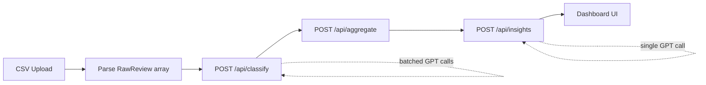

# Review Discovery Engine — Implementation Plan

> Maps [PROJECT_BLUEPRINT.md](./PROJECT_BLUEPRINT.md) to six build phases.  
> Blueprint phases 4 (Root Cause) and 5 (Opportunity) are combined into **Phase 4: Insight Engine**.  
> Blueprint phase 6 (Dashboard) maps to **Phase 5: Dashboard UI**.

---

## Tech Stack

| Layer | Choice | Rationale |
|-------|--------|-----------|
| Framework | Next.js 15 (App Router) | API routes + UI in one repo |
| Language | TypeScript | Shared types across pipeline |
| Styling | Tailwind CSS | Fast iteration on dashboard |
| CSV parsing | `papaparse` | Browser + server compatible |
| AI | OpenAI API (`gpt-4o-mini`) | Cost-effective classification at scale |
| Charts | `recharts` | Simple bar/pie charts for distributions |
| State (MVP) | React context + in-memory | No DB needed for ~600 reviews |

---

## Target Directory Structure

```
reviewDiscoveryEngine/
├── app/
│   ├── layout.tsx
│   ├── page.tsx                    # Upload → pipeline → dashboard flow
│   ├── globals.css
│   └── api/
│       ├── classify/route.ts
│       ├── aggregate/route.ts
│       └── insights/route.ts
├── components/
│   ├── upload/
│   │   ├── FileUpload.tsx
│   │   └── UploadPreview.tsx
│   ├── dashboard/
│   │   ├── ThemeChart.tsx
│   │   ├── SegmentBreakdown.tsx
│   │   ├── BarrierAnalysis.tsx
│   │   ├── RootCauses.tsx
│   │   └── Opportunities.tsx
│   └── ui/
│       ├── Card.tsx
│       ├── ProgressBar.tsx
│       └── LoadingState.tsx
├── lib/
│   ├── types.ts                    # Shared interfaces
│   ├── csv-parser.ts
│   ├── classify-prompt.ts
│   ├── aggregation.ts
│   └── insights-prompt.ts
├── data/
│   └── sample-reviews.csv          # Dev fixture (~10 rows)
├── .env.local                      # OPENAI_API_KEY
├── package.json
└── docs/
```

---

## Shared Types (`lib/types.ts`)

Define once, use everywhere:

```ts
export interface RawReview {
  source: "reddit" | "playstore" | "appstore" | string;
  text: string;
}

export interface ClassifiedReview extends RawReview {
  theme: string;
  behavior: string;
  emotion: string;
  segment: string;
  barrier: string;
  root_cause: string;
  unmet_need: string;
  confidence: number;
}

export interface AggregationResult {
  themeFrequency: Record<string, { count: number; pct: number }>;
  segmentBreakdown: Record<string, { count: number; pct: number }>;
  barrierAnalysis: Record<string, { count: number; pct: number }>;
  totalReviews: number;
}

export interface InsightResult {
  summary: string;
  rootCauses: string[];
  discoveryProblems: string[];
  opportunities: { title: string; description: string }[];
}
```

---

## Phase 0: Setup Next.js App

**Goal:** Runnable app skeleton with upload screen visible.

### Tasks

| # | Task | Details |
|---|------|---------|
| 0.1 | Scaffold project | `npx create-next-app@latest . --typescript --tailwind --eslint --app --src-dir=false` |
| 0.2 | Add dependencies | `papaparse`, `openai`, `recharts`; dev: `@types/papaparse` |
| 0.3 | Create `lib/types.ts` | All shared interfaces (see above) |
| 0.4 | Build UI shell | `app/layout.tsx` — title, max-width container, neutral background |
| 0.5 | Placeholder upload page | `app/page.tsx` — heading, description, empty `FileUpload` slot |
| 0.6 | Stub `FileUpload.tsx` | Drag-and-drop zone + file input (no parsing yet) |
| 0.7 | Env setup | `.env.local.example` with `OPENAI_API_KEY=`; add `.env.local` to `.gitignore` |
| 0.8 | Add sample CSV | `data/sample-reviews.csv` with 5–10 rows for local dev |

### Acceptance Criteria

- [ ] `npm run dev` starts without errors
- [ ] Home page shows "Review Discovery Engine" + upload area
- [ ] File picker accepts `.csv` only

### Estimated effort: **2–3 hours**

---

## Phase 1: CSV Upload + Parsing

**Goal:** Upload CSV → parse → in-memory `RawReview[]`.

### Tasks

| # | Task | Details |
|---|------|---------|
| 1.1 | Implement `lib/csv-parser.ts` | Use papaparse; validate required columns `source`, `text`; trim whitespace; skip empty rows |
| 1.2 | Wire `FileUpload` | On file select → parse client-side → call `onParsed(reviews)` |
| 1.3 | Build `UploadPreview` | Table showing first 5 rows: source badge + truncated text |
| 1.4 | Row count + validation errors | Show "Loaded 612 reviews" or column-missing error |
| 1.5 | App state | `useState<RawReview[]>` in `page.tsx`; gate next step until data loaded |
| 1.6 | Source normalization | Map variants (`Play Store` → `playstore`, etc.) in parser |

### CSV Contract

```csv
source,text
reddit,"I keep hearing the same artists..."
playstore,"Discovery tab is useless"
```

### Acceptance Criteria

- [ ] Valid CSV with `source` + `text` columns parses correctly
- [ ] Invalid CSV shows clear error (missing columns, empty file)
- [ ] Preview table renders parsed rows
- [ ] Handles quoted fields and commas inside text

### Estimated effort: **3–4 hours**

---

## Phase 2: AI Classification API

**Goal:** `POST /api/classify` converts each review to structured JSON.

### Tasks

| # | Task | Details |
|---|------|---------|
| 2.1 | Create `lib/classify-prompt.ts` | System prompt defining taxonomy (themes, segments, barriers) + JSON schema |
| 2.2 | Build `app/api/classify/route.ts` | Accept `{ reviews: RawReview[] }`; return `{ classified: ClassifiedReview[] }` |
| 2.3 | Batch strategy | Process in chunks of 10–20 reviews per GPT call to balance cost/latency |
| 2.4 | Response parsing | `JSON.parse` with fallback retry on malformed output |
| 2.5 | Confidence scoring | Ask model to return 0–1 confidence; default 0.7 if missing |
| 2.6 | Client integration | "Analyze Reviews" button → POST → progress indicator |
| 2.7 | Error handling | Rate-limit retry, API key missing → 500 with message |

### Classification Prompt (sketch)

```
You are a product research analyst for a music streaming app.
For each review, extract:
- theme: primary discovery problem (e.g. Repetition Fatigue, Genre Lock-in)
- behavior: what the user is doing
- emotion: frustration, confusion, satisfaction, etc.
- segment: Long-term user | Explorer | Power listener | Casual
- barrier: Low novelty | No control | Trust issues | Algorithm opacity
- root_cause: one-sentence hypothesis
- unmet_need: what they wish existed
- confidence: 0-1

Return JSON array matching input order.
```

### Acceptance Criteria

- [ ] Single review returns all 8 structured fields
- [ ] 600 reviews complete in < 5 min (batched)
- [ ] Low-confidence items (< 0.5) flagged in UI (optional badge)
- [ ] Works with `sample-reviews.csv` end-to-end

### Estimated effort: **5–6 hours**

---

## Phase 3: Aggregation Engine

**Goal:** `POST /api/aggregate` computes frequency distributions from classified data.

### Tasks

| # | Task | Details |
|---|------|---------|
| 3.1 | Implement `lib/aggregation.ts` | Pure functions: `countByField(reviews, field)` → `{ value: { count, pct } }` |
| 3.2 | Build `app/api/aggregate/route.ts` | Accept `{ classified: ClassifiedReview[] }`; return `AggregationResult` |
| 3.3 | Theme frequency | Group by `theme`; sort desc by count |
| 3.4 | Segment breakdown | Group by `segment` |
| 3.5 | Barrier analysis | Group by `barrier` |
| 3.6 | Cross-tabs (stretch) | Theme × segment matrix for deeper patterns |
| 3.7 | Pipeline wiring | After classify completes → auto-call aggregate → store result |

### Example Output

```json
{
  "themeFrequency": {
    "Repetition Fatigue": { "count": 228, "pct": 38 },
    "Genre Lock-in": { "count": 132, "pct": 22 }
  },
  "segmentBreakdown": { "Long-term users": { "count": 264, "pct": 44 } },
  "barrierAnalysis": { "Low novelty": { "count": 246, "pct": 41 } },
  "totalReviews": 600
}
```

### Acceptance Criteria

- [ ] Percentages sum to ~100% per dimension (rounding tolerance ±1%)
- [ ] Empty input returns zeroed result, not crash
- [ ] Deterministic output for same input (no AI involved)
- [ ] Unit-testable pure functions in `lib/aggregation.ts`

### Estimated effort: **3–4 hours**

---

## Phase 4: Insight Engine

**Goal:** `POST /api/insights` turns aggregated patterns into root-cause narratives and product opportunities.

> Combines blueprint Phase 4 (Root Cause) + Phase 5 (Opportunity).

### Tasks

| # | Task | Details |
|---|------|---------|
| 4.1 | Create `lib/insights-prompt.ts` | Prompt template injecting aggregation stats |
| 4.2 | Build `app/api/insights/route.ts` | Accept `{ aggregation: AggregationResult, sampleReviews: ClassifiedReview[] }` |
| 4.3 | Root cause generation | 3–5 PM-level explanations (why repetition, why limited exploration) |
| 4.4 | Discovery problem statements | "Users struggle to discover music because…" |
| 4.5 | Opportunity generation | 3+ product ideas with title + description |
| 4.6 | Evidence grounding | Pass top 10 reviews per dominant theme as context to reduce hallucination |
| 4.7 | Pipeline wiring | After aggregate → auto-call insights → store `InsightResult` |

### Insight Prompt (sketch)

```
Given these aggregated review patterns for a music streaming app:
- Top themes: {themeFrequency}
- User segments: {segmentBreakdown}
- Barriers: {barrierAnalysis}

And these representative reviews: {samples}

Generate:
1. A 2-sentence executive summary
2. 3-5 root cause explanations (WHY, not WHAT)
3. 3 discovery problem statements
4. 3 product opportunities (title + 1-sentence description each)

Write for a PM audience. Be specific to music discovery.
```

### Acceptance Criteria

- [ ] Insights reference actual top themes from aggregation (not generic)
- [ ] At least 3 opportunities returned, each actionable
- [ ] Root causes explain mechanism, not just restate stats
- [ ] Full pipeline: upload → classify → aggregate → insights completes in one flow

### Estimated effort: **4–5 hours**

---

## Phase 5: Dashboard UI

**Goal:** Visual dashboard showing all pipeline outputs.

> Maps to blueprint Phase 6 (Dashboard).

### Tasks

| # | Task | Details |
|---|------|---------|
| 5.1 | Pipeline state machine | `idle → uploaded → classifying → aggregating → insights → done` |
| 5.2 | `LoadingState.tsx` | Step progress: "Classifying 120/600…" |
| 5.3 | `ThemeChart.tsx` | Horizontal bar chart of theme frequency (recharts) |
| 5.4 | `SegmentBreakdown.tsx` | Donut or stacked bar for user segments |
| 5.5 | `BarrierAnalysis.tsx` | Ranked list with percentage bars |
| 5.6 | `RootCauses.tsx` | Numbered cards with AI explanations |
| 5.7 | `Opportunities.tsx` | Card grid: title, description, optional "impact" tag |
| 5.8 | Layout | Two-column on desktop; stacked on mobile; section headers |
| 5.9 | Export (stretch) | "Download Report" → JSON or markdown summary |
| 5.10 | Polish | Source filter tabs, confidence filter, empty states |

### Dashboard Wireframe

```
┌─────────────────────────────────────────────────┐
│  Review Discovery Engine          [Re-upload]   │
├─────────────────────────────────────────────────┤
│  Executive Summary (AI-generated, 2 sentences)  │
├──────────────────┬──────────────────────────────┤
│ Theme Distribution│  User Segments              │
│ ████ 38% Repet.  │  ◉ Long-term 44%             │
│ ███  22% Genre   │  ◉ Explorer 25%              │
├──────────────────┴──────────────────────────────┤
│  Discovery Barriers                             │
│  Low novelty ████████ 41%                       │
│  No control  █████ 26%                          │
├─────────────────────────────────────────────────┤
│  Root Causes                                    │
│  1. Recommendation systems prioritize…          │
│  2. Historical listening patterns…              │
├─────────────────────────────────────────────────┤
│  Product Opportunities                          │
│  ┌──────────────┐ ┌──────────────┐              │
│  │ Novelty Slider│ │ Explainable  │              │
│  │ …            │ │ Recs …       │              │
│  └──────────────┘ └──────────────┘              │
└─────────────────────────────────────────────────┘
```

### Acceptance Criteria

- [ ] All five dashboard sections render with real pipeline data
- [ ] Loading states between each pipeline stage
- [ ] Responsive layout (mobile + desktop)
- [ ] Re-upload resets state cleanly
- [ ] Demo-ready with full 600-review CSV

### Estimated effort: **6–8 hours**

---

## End-to-End Pipeline Flow



### Client orchestration (`app/page.tsx`)

```ts
async function runPipeline(reviews: RawReview[]) {
  setStep("classifying");
  const { classified } = await fetch("/api/classify", { method: "POST", body: JSON.stringify({ reviews }) }).then(r => r.json());

  setStep("aggregating");
  const aggregation = await fetch("/api/aggregate", { method: "POST", body: JSON.stringify({ classified }) }).then(r => r.json());

  setStep("generating insights");
  const insights = await fetch("/api/insights", { method: "POST", body: JSON.stringify({ aggregation, sampleReviews: classified.slice(0, 30) }) }).then(r => r.json());

  setStep("done");
  return { classified, aggregation, insights };
}
```

---

## Build Order & Dependencies

```
Phase 0 ──► Phase 1 ──► Phase 2 ──► Phase 3 ──► Phase 4 ──► Phase 5
  │            │            │            │            │            │
  skeleton     data         AI           stats        narrative    visuals
```

| Phase | Blocked by | Can test with |
|-------|-----------|---------------|
| 0 | — | Browser visit |
| 1 | 0 | `sample-reviews.csv` |
| 2 | 1 | 10-review subset |
| 3 | 2 | Mock classified JSON |
| 4 | 3 | Mock aggregation JSON |
| 5 | 4 | Full pipeline |

---

## Risk Mitigation

| Risk | Mitigation |
|------|-----------|
| GPT cost for 600 reviews | Batch 15–20 per call; use `gpt-4o-mini`; dev with 10-row sample |
| Inconsistent classification labels | Fixed taxonomy in prompt; normalize casing in aggregation |
| Slow pipeline UX | Progress bar with batch count; consider streaming partial results |
| API key exposure | Server-side routes only; never call OpenAI from client |
| Malformed GPT JSON | Retry once; Zod validation on response shape |

---

## Total Estimated Effort

| Phase | Hours |
|-------|-------|
| 0 — Setup | 2–3 |
| 1 — CSV parsing | 3–4 |
| 2 — Classification | 5–6 |
| 3 — Aggregation | 3–4 |
| 4 — Insights | 4–5 |
| 5 — Dashboard | 6–8 |
| **Total** | **23–30 hours** |

---

## Definition of Done (MVP)

1. User uploads a CSV with 600 reviews
2. App classifies all reviews via GPT
3. Aggregated theme/segment/barrier stats are computed
4. AI generates root causes and product opportunities
5. Dashboard displays all five sections clearly
6. Entire flow works in a single session without page reload
