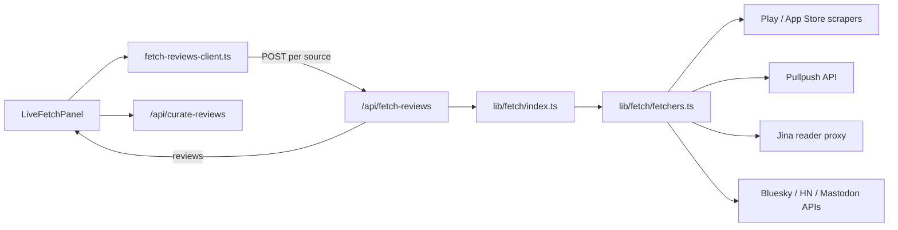

# Review Fetching

How ReviewLens collects Spotify-related reviews from public sources — both **live fetch** (in the app) and **offline corpus** generation (CLI script).

---

## Overview

ReviewLens supports five source types:

| Source ID | Label | What it collects |
|-----------|-------|------------------|
| `playstore` | Play Store | Google Play reviews for the Spotify Android app |
| `appstore` | App Store | Apple App Store reviews for the Spotify iOS app |
| `reddit` | Reddit | Posts and comments from music subreddits and discovery-related searches |
| `spotify-community` | Spotify Community | Forum threads from `community.spotify.com` |
| `social-media` | Social media | Public posts from Bluesky, Hacker News, and Mastodon |

All fetchers target **public** data only. No Spotify login, private APIs, or authenticated scraping is used.

---

## Architecture

There are two ways reviews enter the system:

### 1. Live fetch (app runtime)

Used from the upload page **Live fetch** panel.



**Key files**

| File | Role |
|------|------|
| `components/upload/LiveFetchPanel.tsx` | UI for source selection, limits, filters |
| `lib/fetch-reviews-client.ts` | Browser client; fetches **one source at a time** for progress + partial-failure tolerance |
| `app/api/fetch-reviews/route.ts` | Server route (`GET` config, `POST` fetch) |
| `lib/fetch/index.ts` | Orchestrates selected sources, merges + dedupes |
| `lib/fetch/fetchers.ts` | Per-source fetch implementations |
| `lib/fetch/config.ts` | Source metadata, defaults, limits, Reddit query presets |
| `lib/fetch/utils.ts` | Dedup, min-rating filter, `RawReview` conversion |

### 2. Offline corpus (CLI)

Used to build static CSV files under `docs/review-corpus/`.

```bash
node scripts/fetch-review-corpus.mjs
```

This script mirrors the same source logic as the app fetchers but runs outside Next.js, with higher per-source targets (e.g. 600 Play Store reviews). Output files:

- `playstore.csv`, `appstore.csv`, `reddit.csv`, `spotify-community.csv`, `social-media.csv`
- `all-reviews.csv` — combined export

These CSVs can be uploaded manually in the app; they are **not** loaded automatically at runtime.

---

## API

### `GET /api/fetch-reviews`

Returns fetch configuration for the UI: available sources, sort options, regions, defaults, and limits.

Defined in `lib/fetch/config.ts` via `getFetchConfig()`.

### `POST /api/fetch-reviews`

**Request body**

```json
{
  "sources": ["playstore", "reddit"],
  "limitPerSource": 50,
  "region": "global",
  "playStoreSort": "newest",
  "appStoreSort": "recent",
  "minRating": 0,
  "redditQuery": "discover weekly, recommendations, algorithm"
}
```

| Field | Description |
|-------|-------------|
| `sources` | 1–5 source IDs (max 5 per request) |
| `limitPerSource` | Reviews to collect per source (10–1000, configurable via `FETCH_MAX_REVIEWS_PER_SOURCE`) |
| `region` | Store region code (`us`, `gb`, `de`, `in`, `au`, `ca`) or `global` for all regions |
| `playStoreSort` | `newest` \| `rating` \| `helpful` |
| `appStoreSort` | `recent` \| `helpful` |
| `minRating` | Optional 1–5 filter (store sources only) |
| `redditQuery` | Comma-separated comment search terms (each prefixed with `spotify ` internally) |

**Response**

```json
{
  "reviews": [{ "source": "playstore", "text": "..." }],
  "count": 142,
  "bySource": { "playstore": 50, "reddit": 92 },
  "fetchedAt": "2026-06-21T12:00:00.000Z",
  "label": "live-playstore+reddit-50each"
}
```

The route has `maxDuration = 300` (5 minutes) because multi-source fetches can be slow.

---

## Per-source fetch logic

### Play Store (`playstore`)

- **Package:** `google-play-scraper`
- **App ID:** `com.spotify.music`
- **Pagination:** Token-based via `scraper.reviews({ paginate: true })`
- **Sort:** Maps UI sort to Play Store sort codes (newest / rating / helpful)
- **Region:** Single country or `global` — when global, fetches sequentially from US, GB, DE, IN, AU, CA and dedupes
- **Filters:** Drops reviews under 15 characters; optional `minRating`
- **Output fields:** `source`, `text`, `rating`, `date`, `url` (Play Store review link)

### App Store (`appstore`)

- **Method:** `apps.apple.com` page SSR (since June 2026 the iTunes RSS feed returns 0 reviews)
- **Implementation:** `lib/fetch/app-store-page.ts` — parses `<script id="serialized-server-data">` for `{"$kind":"Review"}` objects
- **App ID / slug:** `324684580` / `spotify-music-and-podcasts`
- **Pagination:** Not chronological pages — aggregates up to 20 storefronts (`us`, `gb`, `de`, …) until `limitPerSource` is met (~10 unique reviews per country)
- **Sort UI:** `recent` / `helpful` is accepted but Apple’s page shows a curated mix (not full RSS-style pagination)
- **Region:** `global` walks all storefronts; single-country requests use one storefront only (~10–50 reviews max)
- **Filters:** Min 15 characters, dedupe by review ID, optional `minRating`
- **Note:** Yields fewer reviews than the old RSS scraper; use bundled `appstore.csv` or add storefronts for larger corpora

### Reddit (`reddit`)

- **API:** [Pullpush](https://api.pullpush.io) Reddit archive (`https://api.pullpush.io/reddit/search/{submission|comment}/`)
- **No Reddit API key** required

Collection runs in three passes until the limit is reached:

1. **Subreddit submissions** — posts from:
   - `r/spotify`, `r/truespotify`, `r/SpotifyPlaylists`, `r/LetsTalkMusic`, `r/music`
   - Text = `title + selftext`; skips removed posts; min 20 chars

2. **Comment search** — for each discovery query (default: `discover weekly`, `recommendations`, `algorithm`, `discovery`, `radio`, `playlist`, `recommend`, `wrapped`, `daily mix`):
   - Searches comments with `q=spotify <query>`
   - Skips `[deleted]` / `[removed]`; min 25 chars

3. **Subreddit comments** — top two subreddits (`spotify`, `truespotify`) for additional comment volume

Custom queries can be passed via `redditQuery` in the UI (comma-separated).

### Spotify Community (`spotify-community`)

- **Method:** Fetch forum board pages as markdown via [Jina Reader](https://jina.ai/reader/) (`https://r.jina.ai/<url>`)
- **Boards scraped:**
  - Content Questions, Your Library, iOS, Android, Desktop Windows
  - Music Discussion, Discovery & Promo, Accounts
- **Pagination:** Up to 6 pages per board (`?sort_by=-topicPostDate` for page 2+)
- **Parsing:** Extracts thread title + body from markdown `## [title](url)` blocks; strips view/like counts
- **Rate limiting:** 1.2s sleep between page requests

### Social media (`social-media`)

Aggregates from three public APIs, in order:

1. **Bluesky** — `public.api.bsky.app` search for 8 Spotify-related queries (recommendations, discover weekly, algorithm, etc.)
2. **Hacker News** — Algolia API (`hn.algolia.com`) for comment search on Spotify discovery topics
3. **Mastodon** — Search API on `mastodon.social`, `mas.to`, `mstdn.social` for recommendation/discovery queries

All posts/comments must be at least 25 characters. HTML tags are stripped from Mastodon/HN content.

---

## Shared processing

Applied across sources in `lib/fetch/utils.ts` and `lib/fetch/index.ts`:

| Step | Rule |
|------|------|
| **Text dedupe** | First 220 characters of lowercase text used as key |
| **Min length** | 15 chars (stores), 20–25 chars (Reddit/social/community) |
| **Min rating** | Store sources only; filters rows where `rating < minRating` |
| **Merge** | When multiple sources selected, rows are concatenated then deduped again |
| **RawReview shape** | Final app payload keeps only `{ source, text }` — rating/date/url are dropped before classification |

The browser client (`lib/fetch-reviews-client.ts`) fetches sources **sequentially** (one POST per source) so the UI can show per-source progress and survive partial failures. If some sources fail, a `warning` is returned with reviews from sources that succeeded.

---

## Configuration

| Setting | Location | Default |
|---------|----------|---------|
| Max reviews per source | `FETCH_MAX_REVIEWS_PER_SOURCE` env var | `1000` |
| Min per source | `lib/fetch/config.ts` | `10` |
| Default per source (UI) | `lib/fetch/config.ts` | `50` |
| Max sources per request | `lib/fetch/config.ts` | `5` |
| User-Agent | `lib/fetch/config.ts` | `Mozilla/5.0 (compatible; ReviewLens/1.0; research)` |

Spotify app identifiers (shared by live fetch and corpus script):

- Play Store: `com.spotify.music`
- App Store: `324684580`

---

## After fetch

Live-fetched reviews flow into the standard analysis pipeline:

1. **Curation** — `POST /api/curate-reviews` filters discovery-relevant reviews (keyword/heuristic gate before LLM)
2. **Classification** — `POST /api/classify` (Gemini or mock)
3. **Aggregation / findings** — deterministic PM research outputs

Fetched reviews are **not** written to Turso until the user saves an analysis run to the repository.

---

## Failure modes

| Scenario | Behavior |
|----------|----------|
| Single source fails (client) | Other sources still load; warning shown |
| All sources fail | Error thrown; user prompted to try another source or upload CSV |
| App Store partial pages | Returns what was collected; may be under limit |
| Reddit/Community rate limits | Pass continues with remaining subreddits/boards |
| Community board parse empty | Stops pagination for that board |
| Global region | Slower (sequential multi-country store fetches) |

---

## Offline corpus targets

`scripts/fetch-review-corpus.mjs` uses fixed targets (not UI-configurable):

| File | Target count |
|------|--------------|
| `playstore.csv` | 600 |
| `appstore.csv` | 600 |
| `reddit.csv` | 500 |
| `spotify-community.csv` | 300 |
| `social-media.csv` | 300 |

The corpus script uses US-only store fetching (unlike live fetch `global` mode) and writes CSV columns: `source,text,rating,date,url`.

---

## Related files

```
lib/fetch/
  config.ts      # Source registry, limits, Reddit defaults
  fetchers.ts    # Per-source implementations
  index.ts       # Orchestration + request parsing
  types.ts       # FetchSourceId, request/response types
  utils.ts       # dedupe, min-rating, toRawReviews

app/api/fetch-reviews/route.ts
lib/fetch-reviews-client.ts
components/upload/LiveFetchPanel.tsx
scripts/fetch-review-corpus.mjs
docs/review-corpus/          # Static CSV outputs
```
